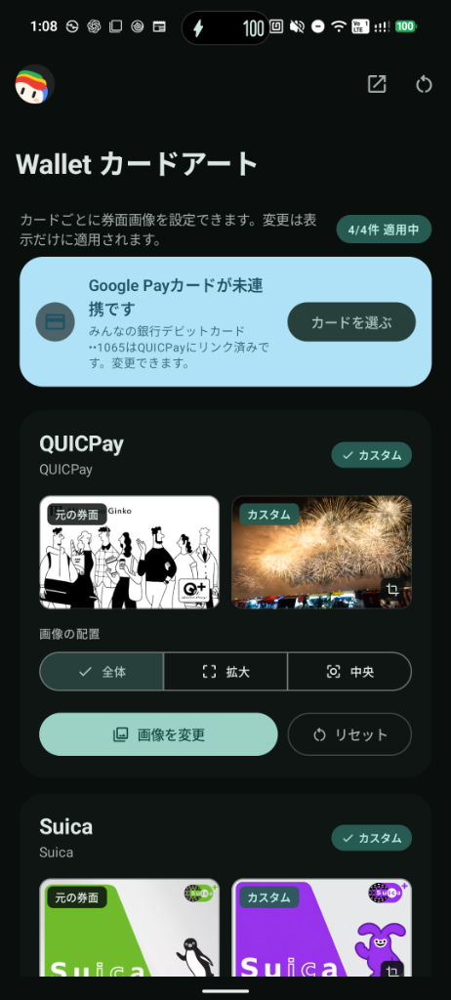
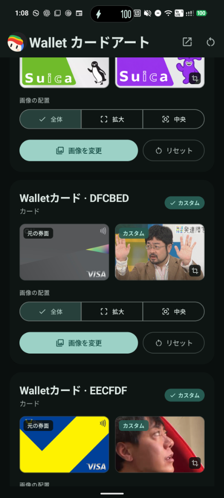
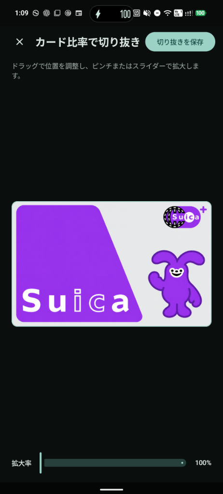
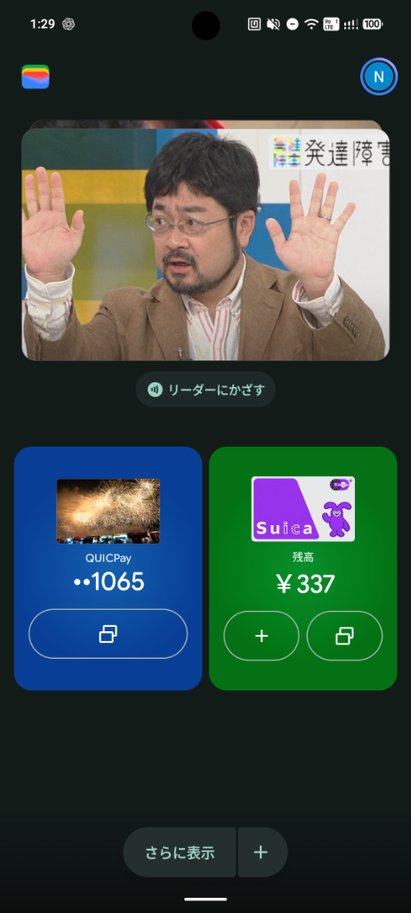
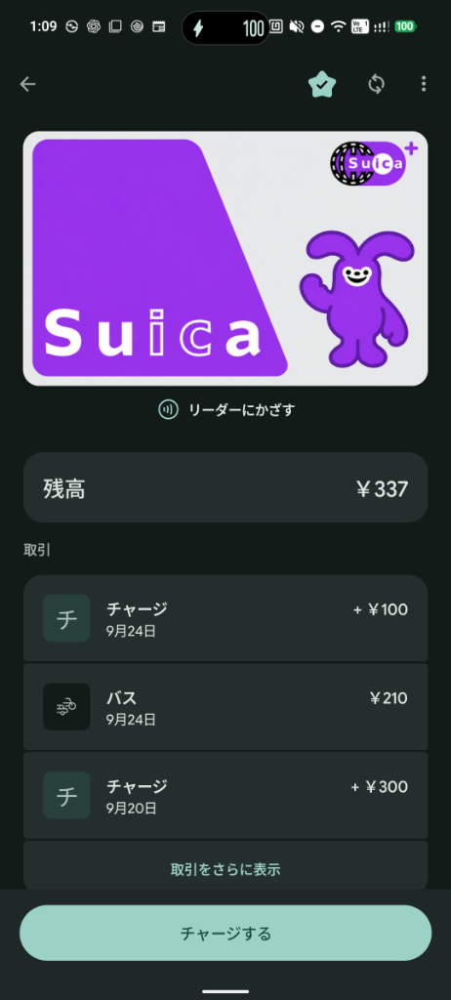
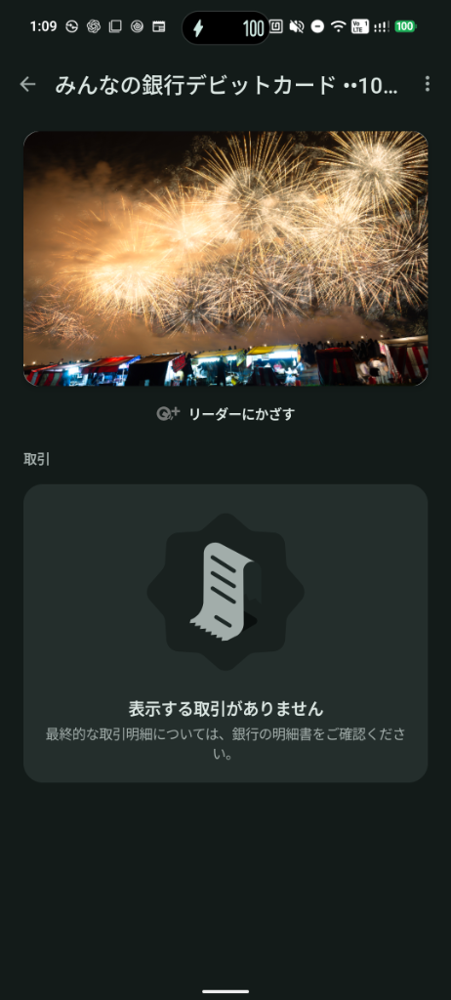
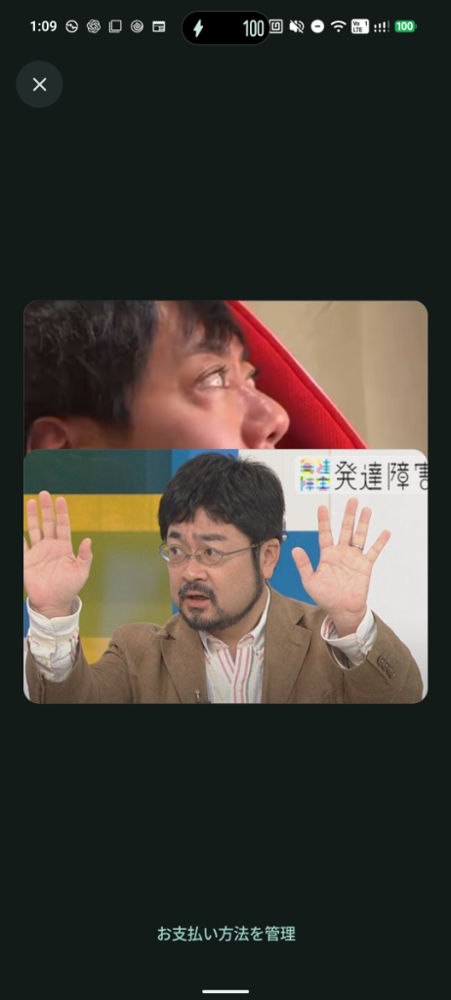

# WallArt

**English** | [日本語](README.ja.md)

An LSPosed module to customize card artwork in Google Wallet on a per-card basis, featuring a Material 3 Expressive interface. Images are stored locally and never interfere with payment data or NFC operations.

## Screenshots

### WallArt Manager App (Material 3 Expressive)

Preview, select, crop, and configure fit modes for each detected card with ease.

<p align="center">
  
  
  
</p>

<p align="center">
  <sub>Left & Center: WallArt Manager ｜ Right: Standard card ratio (12dp corner radius) crop editor</sub>
</p>

### Google Wallet Showcase

Custom artwork seamlessly reflects across the carousel, shortcut tiles, and detailed card views.

<p align="center">
  
  
  
  
</p>

<p align="center">
  <sub>Left to right: Google Wallet Home ｜ Suica Details ｜ Debit Card Details (Minna no Ginko) ｜ Manage payment method view</sub>
</p>

## Compatibility

- **Google Wallet**: `com.google.android.apps.walletnfcrel` — `26.37.981219770`
- **GMS Card Details & Tap Confirmation**: Replaces visual artwork in `PayActivity` and `TapActivity` / `TAP_EVENT` (requires GMS scope). Card matching is performed against Wallet selection data and labels; payment execution is untouched.
- **LSPosed Modern API**: 102+
- **Manager App**: English & Japanese, with support for per-app language settings (Android 13+).

Wallet and GMS packages are defined as static scopes in the APK. Hook execution in GMS is strictly confined to `PayActivity` and never touches other Google Play services screens or payment processes.

## Build

Requires Android SDK 37. Run via PowerShell:

```powershell
.\gradlew.bat testDebugUnitTest assembleDebug --no-daemon --max-workers=1
```

APK output: `app/build/outputs/apk/debug/app-debug.apk`

## Installation

1. Install the APK normally.
2. Enable WallArt in LSPosed / Vector (scopes for Wallet and GMS are fixed in the APK).
3. Open WallArt once to grant local image read permission to Wallet and GMS Pay UI. Permissions are automatically renewed on boot and app updates.
4. Open Google Wallet once to detect registered cards, then return to WallArt to set custom artwork. Crop to card ratio via the Photo Picker.
5. Force-stop the target app and reopen it to apply changes. No system reboot required.

Supports PNG, JPEG, and WebP. Images are stored in app-private storage, and the Reset button restores original artwork at any time.

## Documentation

- [docs/research.md](docs/research.md): Target APK analysis and GMS boundaries
- [docs/maintenance.md](docs/maintenance.md): Architecture, scopes, verification, and update guides

## Verified Environments

- Google Wallet `26.37.981219770` (Home cards, Suica/QUICPay favorite tiles, GMS card details) verified on Nothing Phone (A059) / Android 17.

## Security Boundary

WallArt changes only the local visual representation of card artwork. It does not modify payment credentials, NFC/HCE, TapAndPay, authentication, attestation, Google Play Integrity, root detection, or payment decisions.

## License

Copyright (C) 2026 tqmane. Licensed under [GPL-3.0-only](LICENSE).
